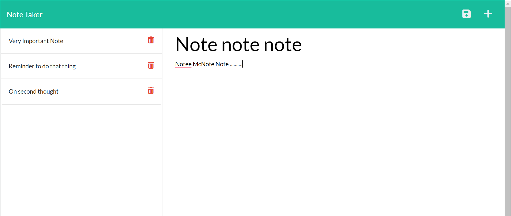

# Note-Keeper  

## Description: 

* A note taking app that allows you to write, save, and delete notes using Express.js

* <a href='https://www.github.com/BDunham484/Note-Keeper'>https://www.github.com/BDunham484/Note-Keeper</a>

## Made With:

* HTML
* css
* JavaScript
* Node.js
* Express.js

## Code Contributors

#### Made with ❤️ by:

* Brad Dunham

    
